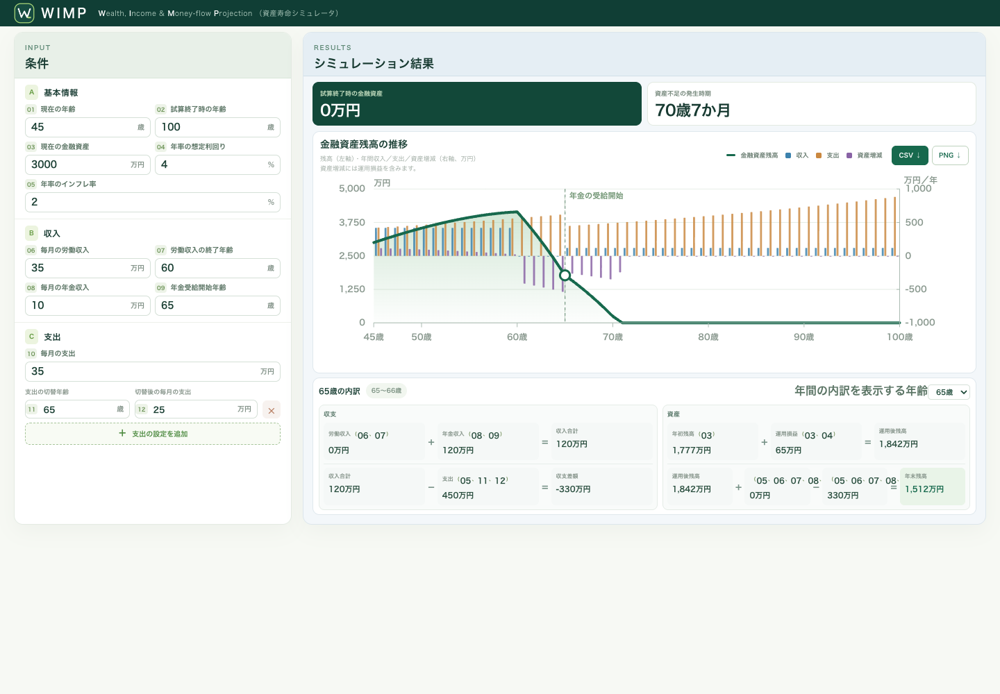

# WIMP

[](https://github.com/shinichi-takayanagi/wimp/actions/workflows/pages.yml)


WIMP (**W**ealth, **I**ncome & **M**oney-flow **P**rojection) is a browser-based tool for projecting monthly financial asset balances from spending, employment income, pension income, and an assumed investment return. It uses no external libraries or server-side processing.



## Run locally

Run the following command in this directory, then open <http://localhost:8000>. `npx` downloads `http-server` temporarily if it is not already available.

```sh
npx --yes http-server . -p 8000
```

The app can also be deployed as-is to any static file host.

## Deployment

On each push to `main`, GitHub Actions runs the simulation tests and deploys to GitHub Pages only if they pass. The same tests run for pull requests targeting `main`. The published site consists of `index.html`, `styles.css`, `app.mjs`, and `engine.mjs`.

Live site: <https://shinichi-takayanagi.github.io/wimp/>

## Tests

```sh
node --test engine.test.mjs
```
